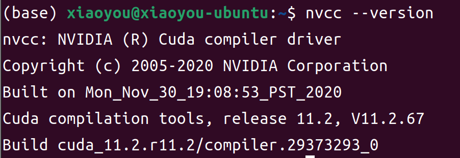

> 这里主要主要是以Ubuntu 22.04 来举例

## 驱动安装

直接到软件和更新到附加驱动里面安装一个即可


## cuda安装

我的显卡是3060，使用下面这个版本的cuda和cudnn

cuda下载地址：[点击下载](https://developer.nvidia.com/cuda-toolkit-archive)

cudnn 下载地址: [点击下载](https://developer.nvidia.com/rdp/cudnn-archive)


下载好的文件如下所示


运行下面的命令

```shell
sudo bash cuda_11.2.0_460.27.04_linux.run
```

驱动就不需要安装了，然后我们安装


安装成功会有下面的提示


然后我们还需要设置一下环境变量,这里需要用点去链接多个lib
`LD_LIBRARY_PATH`是专门存放动态链接库的

```shell
sudo vim /etc/profile
export CUDA_DIR=/usr/local/cuda-11.2
export PATH=$PATH:$CUDA_DIR/bin
export LD_LIBRARY_PATH=$LD_LIBRARY_PATH:$CUDA_DIR/extras/CUPTI/lib64.$CUDA_DIR/lib64
```

然后我们还需要解压一下cudnn

```shell
tar -zxf cudnn-11.2-linux-x64-v8.1.0.77.tgz
# 把里面所有的文件拷贝到/usr/local/cuda-11.2 里去
sudo cp include/* /usr/local/cuda-11.2/include
sudo cp lib64/* /usr/local/cuda-11.2/lib64
```

最后我们输入`nvidia-smi`查看显卡信息


输入 `nvcc --version` 查看cuda版本



输入 `nvidia-smi -L` 查看显卡型号

