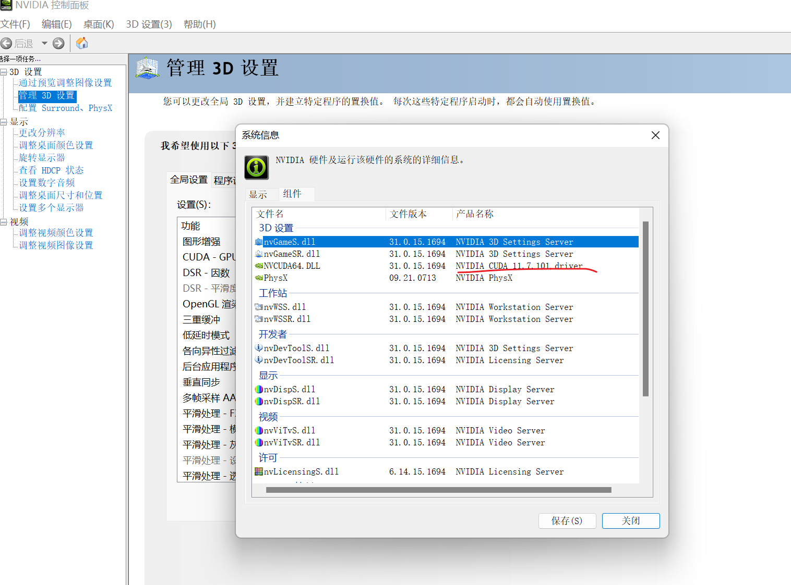
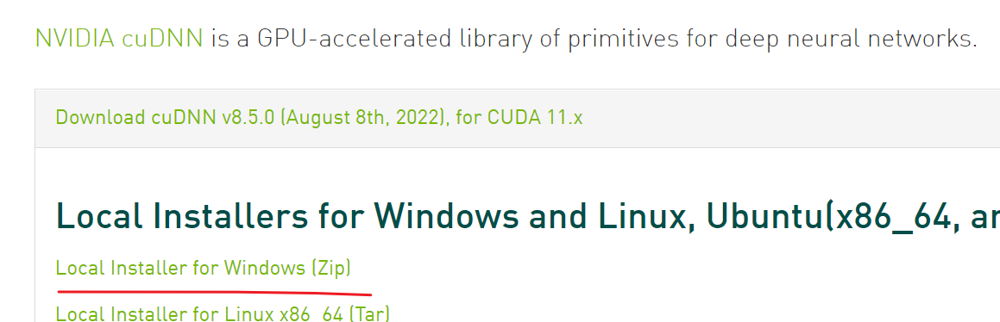
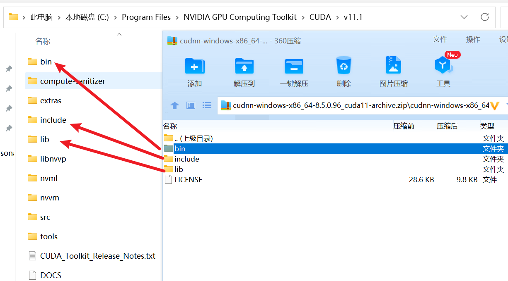

## cuda安装

windows显卡驱动这里就不多说，我们直接去安装cuda，历史版本的cuda可以到https://developer.nvidia.com/cuda-toolkit-archive里去找

打开显卡的控制面板，可以看到最高支持的版本


这里我选择安装`11.1.1`版本的，也就是这个：https://developer.nvidia.com/cuda-11.1.1-download-archive?target_os=Windows&target_arch=x86_64

然后下载cudnn[下载地址](https://developer.nvidia.com/rdp/cudnn-archive)，我选的是下面这个


我们双击安装cuda，安装过程这里就不详细说明，安装完毕后我们可以打开cudnn的压缩包，按照下图的顺序放到对于的文件夹


## pytorch安装

我们可以使用conda来管理虚拟环境，conda安装这里不详细说明，我们可以使用下面的命令来安装pytorch

```shell
pip3 install torch==1.8.2 torchvision==0.9.2 torchaudio===0.8.2 --extra-index-url https://download.pytorch.org/whl/lts/1.8/cu111
```

然后使用下面的代码来进行测试

```python
import torch
flag = torch.cuda.is_available()
if flag:
    print("CUDA可使用")
else:
    print("CUDA不可用")

ngpu= 1
# Decide which device we want to run on
device = torch.device("cuda:0" if (torch.cuda.is_available() and ngpu > 0) else "cpu")
print("驱动为：",device)
print("GPU型号： ",torch.cuda.get_device_name(0))
```
